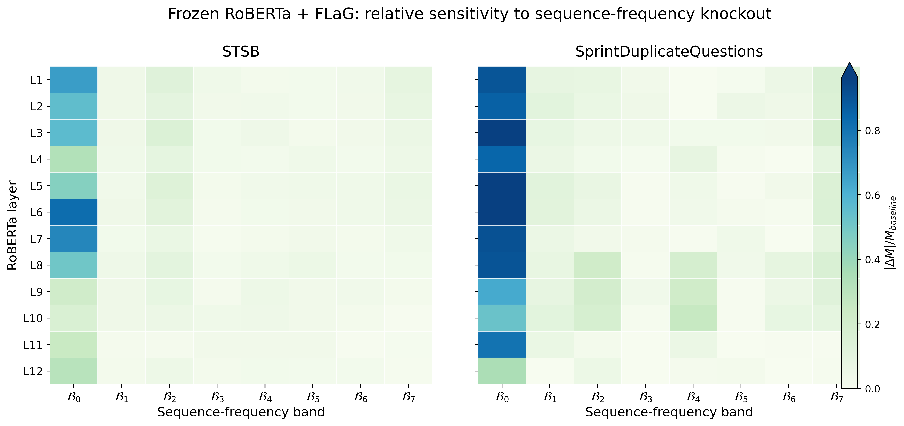
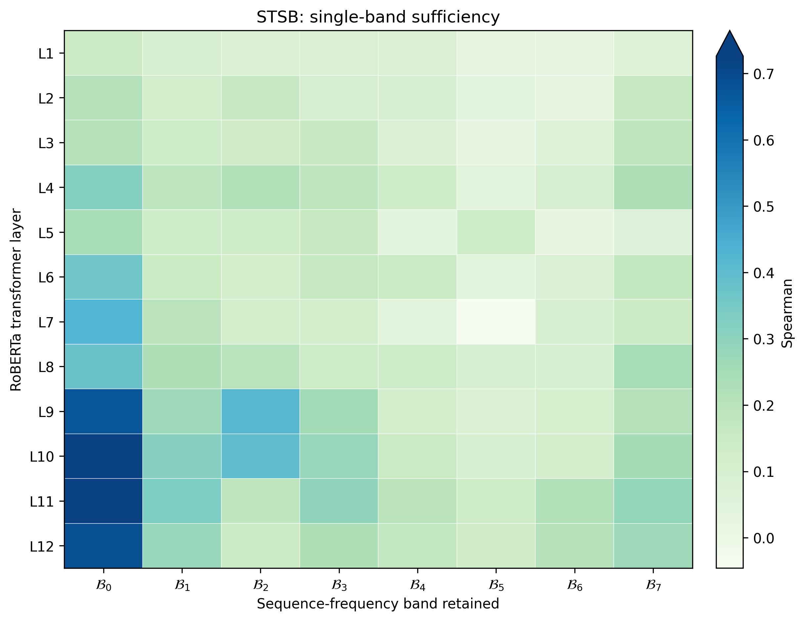
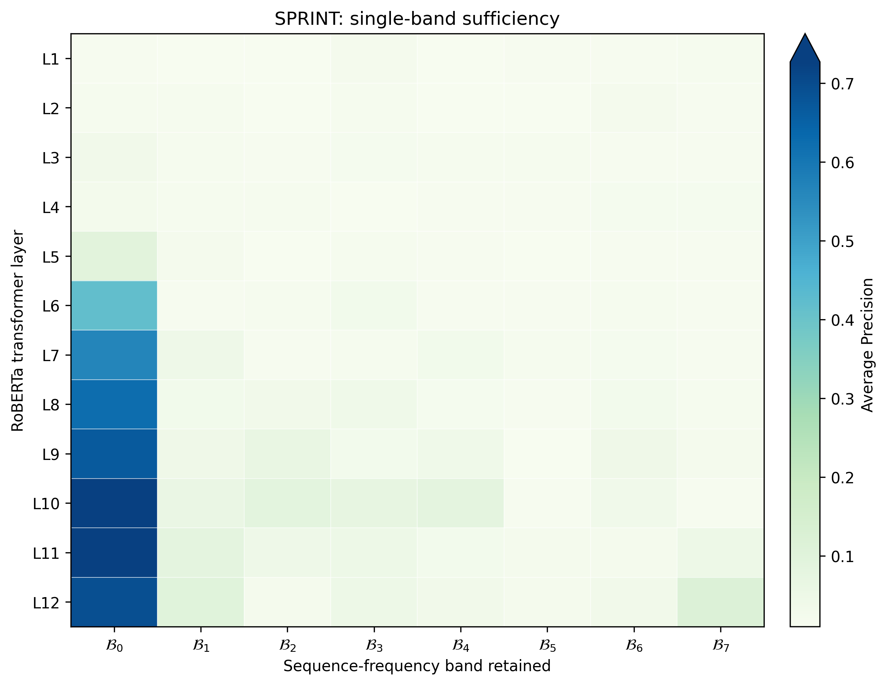

# DC / 频带机制：STSB 与 Sprint 的 frozen-backbone 对照

本页记录一组专门回答 **“DC 分量到底承载了什么，以及模型是否真的依赖 DC”** 的机制实验。使用 **frozen RoBERTa-base + trainable FLaG** 设置。

> 当前页面使用 seed 0 的 frozen-backbone 控制实验。STSB 指标为 **Spearman**，Sprint 指标为 **Average Precision (AP)**。两者指标不同，因此跨任务比较时优先看相对变化，而不是直接比较绝对数值。

---

## 1. 问题

我们希望区分三个不同的问题：

1. **DC readability**：直接读取 DC / global-mean 成分，能得到多少任务信息？
2. **Band-only sufficiency**：只保留某一频带，完整模型还能恢复多少性能？
3. **Band-knockout dependency**：删除某一频带，完整模型性能会下降多少？

这三者不能混为一谈：

- **band-only** 更接近“这一频带单独够不够用”；
- **knockout** 更接近“模型实际依不依赖这一频带”；
- 二者同时成立时，证据最强。

---

## 2. 统一实验设置

| 项目 | STSB | SprintDuplicateQuestions |
| --- | --- | --- |
| Backbone | RoBERTa-base，**frozen** | RoBERTa-base，**frozen** |
| Pooling | FLaG | FLaG |
| Backbone 是否参与任务训练 | 否 | 否 |
| Pooling 是否训练 | 是 | 是 |
| 主指标 | Spearman | Average Precision |
| 频带数 | 8（B0–B7） | 8（B0–B7） |
| Knockout norm restoration | 是，AMP-compatible | 是，AMP-compatible |
| Band-only norm restoration | 否 | 否 |

Frozen STSB FLaG 的 seed-0 test 结果：

- Spearman = **0.710535**
- Pearson = **0.720285**

---

## 3. Band knockout：删除哪个频带最伤模型？

定义：

\[
\Delta M_{l,k}
=
M_{\text{baseline}}
-
M_{\text{knockout}(l,k)}
\]

其中 \(l\) 为 RoBERTa 层，\(k\) 为频带。

- \(\Delta M>0\)：删除该频带使性能下降；
- \(\Delta M<0\)：删除后反而略有提升，说明该频带在当前 checkpoint 下可能不是正贡献，或存在冗余/干扰。

### 3.1 最后一层 L12

| 任务 | Baseline | 删除 B0 后 | B0 drop | 相对下降 |
| --- | ---: | ---: | ---: | ---: |
| STSB | 0.710311 | 0.492913 | **0.217398** | **30.6%** |
| Sprint | 0.757690 | 0.493323 | **0.264368** | **34.9%** |

STSB L12 各频带：

| Band | Drop |
| --- | ---: |
| **B0** | **0.217398** |
| B1 | 0.015078 |
| B2 | 0.036547 |
| B3 | 0.015344 |
| B4 | 0.021344 |
| B5 | 0.016429 |
| B6 | 0.016766 |
| B7 | 0.008004 |

Sprint L12 各频带：

| Band | Drop |
| --- | ---: |
| **B0** | **0.264368** |
| B1 | -0.001295 |
| B2 | 0.041159 |
| B3 | 0.000924 |
| B4 | 0.014051 |
| B5 | 0.015914 |
| B6 | -0.002491 |
| B7 | -0.007384 |

**结果：两边最后一层都是 B0/DC 明显最重要。** B0 的 knockout 损失远高于任何单个非 DC 频带。

### 3.2 B0 dependency 随层变化

STSB 的 B0 knockout drop：

| Layer | Δ |
| ---: | ---: |
| L1 | 0.475 |
| L3 | 0.400 |
| L6 | **0.583** |
| L7 | 0.524 |
| L9 | 0.151 |
| L10 | 0.117 |
| L11 | 0.178 |
| L12 | 0.217 |

STSB 的 DC dependency 在**中层最强**，进入高层后整体减弱，但 L12 仍然明显依赖 DC。

Sprint 的 B0 knockout drop：

| Layer | Δ |
| ---: | ---: |
| L1 | 0.681 |
| L3 | 0.729 |
| L5 | 0.734 |
| L6 | **0.744** |
| L8 | 0.684 |
| L10 | 0.399 |
| L11 | 0.610 |
| L12 | **0.264** |

Sprint 的一个突出特征是：

\[
L11: 0.610
\rightarrow
L12: 0.264
\]

也就是**最后一层 DC dependency 明显下降**。这一模式与 AMP 机制实验中“最终层 DC contribution 骤降”的观察方向相似。

注意到非DC频带

> 在STSB上 的 B1-B7 **几乎全部是正 drop，所有drop里只有一个负数**，说明这些非 DC 成分虽然不如 B0，但基本都在提供正向信息。

> 在Sprint 上**drop正负交替**，每一个频带提供信息抖动，但求和发现带来的整体drop大部分layer上高于STSB任务

> 经过平均计算后，发现Sprint上每一层非DC频带的整体平均值大部分高于STSB，且变化程度高，不如STSB上平缓

## 4. Band-only：只给一个频带，模型还能做多少？

Band-only 与 knockout 正好相反：

\[
H^{(l)}
\rightarrow
DCT
\rightarrow
\text{keep only } B_k
\rightarrow
IDCT
\rightarrow
\text{later layers}
\rightarrow
FLaG
\]

这里**不做 norm restoration**。

对于 L1–L11，保留下来的单频带仍会经过后续 Transformer 层，因此后续层可以重新产生新的频率结构。

因此最干净的直接单频带测试是 **L12**：L12 后面已经没有 Transformer 层，只剩 FLaG。

### 4.1 L12：B0 单独几乎可以恢复完整模型

| 任务 | Baseline | B0-only | 保留 baseline 比例 | 最强非 B0 单频带 |
| --- | ---: | ---: | ---: | ---: |
| STSB | 0.710311 | **0.684905** | **96.4%** | B1 = 39.6% |
| Sprint | 0.757690 | **0.692524** | **91.4%** | B7 = 15.0% |

STSB L12：

| Band | Band-only metric | Baseline fraction |
| --- | ---: | ---: |
| **B0** | **0.684905** | **96.4%** |
| B1 | 0.281616 | 39.6% |
| B2 | 0.146808 | 20.7% |
| B3 | 0.226917 | 31.9% |
| B4 | 0.174942 | 24.6% |
| B5 | 0.126907 | 17.9% |
| B6 | 0.210444 | 29.6% |
| B7 | 0.266920 | 37.6% |

Sprint L12：

| Band | Band-only metric | Baseline fraction |
| --- | ---: | ---: |
| **B0** | **0.692524** | **91.4%** |
| B1 | 0.097830 | 12.9% |
| B2 | 0.023563 | 3.1% |
| B3 | 0.047994 | 6.3% |
| B4 | 0.032518 | 4.3% |
| B5 | 0.022983 | 3.0% |
| B6 | 0.033055 | 4.4% |
| B7 | 0.113973 | 15.0% |

这说明 B0/DC 不只是“删掉以后很重要”，而且**单独留下 B0 就已经接近完整模型性能**。

注意到非DC频带

> STSB集上虽然 B0 仍然是绝对主导，但非 DC 频带中仍然分散着更多可用的任务信息。

> Sprint据集上它高度依赖 B0，而且除了 B0 之外，单个非 DC 频带几乎都没有很强的独立预测能力。

---

## 5. B0-only 随深度变化

### STSB

| Layer | B0-only / baseline |
| ---: | ---: |
| L1 | 20.7% |
| L2 | 29.2% |
| L3 | 28.8% |
| L4 | 44.8% |
| L5 | 34.0% |
| L6 | 51.0% |
| L7 | 60.2% |
| L8 | 53.2% |
| L9 | 94.2% |
| L10 | 102.2% |
| L11 | 103.7% |
| L12 | 96.4% |

### Sprint

| Layer | B0-only / baseline |
| ---: | ---: |
| L1 | 1.8% |
| L2 | 2.2% |
| L3 | 4.3% |
| L4 | 3.2% |
| L5 | 12.3% |
| L6 | 55.2% |
| L7 | 74.5% |
| L8 | 82.1% |
| L9 | 88.1% |
| L10 | 95.7% |
| L11 | 100.4% |
| L12 | 91.4% |

一个非常明显的共同趋势是：

> **随着 RoBERTa 加深，单独依靠 B0 恢复任务性能的能力迅速增强。**

特别是 Sprint，从 L1 的 1.8% 增长到 L11 的 100.4%，表现得像一个逐层把 task-relevant global information 汇入 B0 的“信息漏斗”。

---

## 6. 当前可以得出的结论

### C1. DC/B0 是两个任务共同的核心全局信息通道

在 frozen RoBERTa + FLaG 的匹配条件下：

- STSB L12 B0-only 保留 **96.4%** baseline；
- Sprint L12 B0-only 保留 **91.4%** baseline；
- 删除 B0 又分别造成约 **30.6%** 和 **34.9%** 的相对性能下降；
- 其他单个频带都远弱于 B0。

因此 B0 同时表现出：

- **高 sufficiency**：只保留它仍能完成大部分任务；
- **高 dependency**：删掉它又会造成最大的性能损失。

### C2. STSB 提供了“语义信息高度集中于 DC”的直接任务证据

STSB 的目标本身就是 sentence-level semantic similarity。

最终层仅保留 B0 时仍保留约 **96.4%** 的完整模型 Spearman，而删除 B0 又造成最大的性能损失。

因此当前结果支持：

> **STSB 所需的句级整体语义相似性信息，在最终 RoBERTa 表示中高度集中于、或至少高度可由 DC / global-mean component 读取。**

### C3. DC 不能简单等同于“语义”

Sprint 的 B0-only 同样保留 **91.4%** baseline，而且 B0 knockout 同样造成最大损失。

因此 DC 更可能是：

> **一种普遍的 global task-relevant information channel，其中当然可以包含 sentence-level semantics，但并不只编码 STSB 式语义相似度。**

### C4. STSB 与 Sprint 的主要差异不在“谁更依赖 DC”，而在深度方向上的组织方式

实验并不支持“STSB 比 Sprint 更依赖 DC”。

相反：

- Sprint 的 B0 knockout sensitivity 整体很强；
- Sprint 在 L11 → L12 出现明显的 DC contribution drop；
- STSB 更像中层达到 DC dependency 高峰，再在高层减弱。

STSB中非DC频带整体预测能力低，重要性变化大，但重要性求和数值大于Sprint

Sprint中非DC频带预测能力较高，重要性平缓，不是很大

就感觉这个结论在打架

---

## 7. 训练过程中直接删除 / 仅保留 exact DC

前面的 layer-band knockout / band-only 使用的是 **Prism B0–B7 频带划分**。这里进一步做一个更严格的控制：

> **直接对 FLaG 实际 rFFT 后的精确 \(k=0\) 系数进行操作。**

因此本节里的 **exact DC** 与前文的 **B0 低频带** 要区分开：

- **B0**：Prism 划分下最低频带，可能包含 DC 及其它低频系数；
- **exact DC**：严格只指 rFFT 的 \(k=0\) 系数。

### 7.1 实验设计

为了避免“训练时删除 DC”和“只保留 DC”两边模型容量不同，主比较使用三个严格匹配的 frozen-backbone FLaG：

| 条件 | RoBERTa | FLaG | 可见频率 | 是否训练 |
| --- | --- | --- | --- | --- |
| **Full FLaG** | frozen | trainable | \(k=0\) + \(k>0\) | 是 |
| **No-DC FLaG** | frozen | trainable | 仅 \(k>0\) | 是 |
| **DC-only FLaG** | frozen | trainable | 仅 \(k=0\) | 是 |

另外保留：

| 参考项 | 说明 |
| --- | --- |
| **Exact DC / Mean** | frozen RoBERTa + masked Mean pooling；parameter-free exact-DC readout |

三个 FLaG 条件的 backbone、模型容量、优化器和训练协议保持一致，唯一变量是 **训练过程中允许模型看到哪些频率**。

实现上：

- No-DC：在真实 rFFT 后将 spec[:, 0] 置零；
- DC-only：保留 spec[:, 0]，其余 spec[:, 1:] 全部置零；
- sanity check 同时验证：
  - No-DC 只改变 \(k=0\)；
  - DC-only 只保留 \(k=0\)；
  - 其它频率不会被连带修改。

### 7.2 Seed-0 结果

#### STSB：test Spearman

| 条件 | Spearman | 相对 Full |
| --- | ---: | ---: |
| **Full FLaG** | 0.710535 | 100.0% |
| **No-DC FLaG** | 0.646152 | 90.9% |
| **DC-only FLaG** | **0.746003** | **105.0%** |
| Exact DC / Mean | 0.543549 | 76.5% |

#### Sprint：validation AP

| 条件 | Validation AP | 相对 Full |
| --- | ---: | ---: |
| **Full FLaG** | 0.757690 | 100.0% |
| **No-DC FLaG** | 0.628402 | 82.9% |
| **DC-only FLaG** | **0.916407** | **120.9%** |
| Exact DC / Mean | 0.302018 | 39.9% |

Sprint official test 上：

| 条件 | Test AP |
| --- | ---: |
| **Full FLaG** | 0.724596 |
| **No-DC FLaG** | 0.534044 |
| **DC-only FLaG** | **0.894565** |

这说明 Sprint 上的 DC-only 增益并不只出现在 validation，official test 同样保持。

### 7.3 直接观察

#### STSB

- 训练阶段持续删除 exact DC 后，仍保留约 **90.9%** 的 Full 性能；
- 只保留 exact DC 并训练同一个 FLaG，反而达到 **0.7460**，高于 Full 的 **0.7105**；
- parameter-free Mean 只有 **0.5435**。

因此：

> **DC 中包含很强的 STSB task-relevant information，但“DC 中有信息”不等于“直接 Mean + cosine 就能充分读取这些信息”。**

#### Sprint

- No-DC FLaG test AP 从 **0.7246** 降到 **0.5340**；
- DC-only FLaG test AP 达到 **0.8946**；
- frozen Mean / exact-DC raw readout 只有 validation AP **0.3020**。

因此 Sprint 上更明显地表现出：

> **预训练 RoBERTa 的 final-layer exact DC 中已经存在很强的任务相关信息；专门针对 DC 训练的 FLaG readout 可以把这些信息显著解码出来。**

与此同时：

> **No-DC 仍然能取得不低的性能，说明 non-DC 中也存在可利用信息，但在当前设置下其独立能力明显弱于 DC-only。**

---

## 8. Sprint DC-only 的 padding / length shortcut 排查

由于 Sprint DC-only FLaG 的 test AP 达到 **0.894565**，需要排查其是否只是利用了 dynamic padding、batch composition 或句长捷径。

### 8.1 Dynamic-padding batch size

同一个 DC-only checkpoint，在不同 batch size 下重新评估 validation AP：

| Batch size | Validation AP |
| ---: | ---: |
| 1 | 0.917211 |
| 8 | 0.916872 |
| 32 | 0.915688 |
| 64 | 0.916407 |
| 128 | 0.916413 |

最大波动约 **0.0015 AP**，非常小。

### 8.2 改变 batch grouping / order

固定 batch size = 64：

| 顺序 | Validation AP |
| --- | ---: |
| Natural order | 0.916407 |
| Permuted order | 0.916893 |
| Absolute difference | **0.000486** |

随机改变样本分组后结果几乎不变。

### 8.3 Dynamic padding vs fixed padding=128

| Split | Dynamic padding | Static padding=128 |
| --- | ---: | ---: |
| Validation AP | 0.916407 | 0.906464 |
| Test AP | 0.894565 | **0.884416** |

固定 padding 后确实下降约 **0.01 AP**，说明 padding 方式有轻微影响，但无法解释整体高性能。

即使使用 static padding=128：

\[
0.8844 \gg 0.7246
\]

仍明显高于 Full FLaG 的 test AP。

### 8.4 Length-only baseline

仅使用两句话的 token length、长度差、长度比例等简单长度特征：

| Baseline | Validation AP | Test AP |
| --- | ---: | ---: |
| Logistic regression on length features | 0.011315 | 0.010996 |
| \(-|L_1-L_2|\) | 0.011421 | 0.010553 |

这一水平接近 Sprint 的正样本比例，说明**简单句长信息本身几乎不能完成任务**。

### 8.5 当前结论

综合 batch size、batch grouping、fixed padding 和 length-only baseline：

> **Sprint DC-only FLaG 的高性能不能由 dynamic padding、batch composition 或简单 sentence-length shortcut 解释。**

目前更合理的解释是：

> **Frozen RoBERTa 的 final-layer exact DC 中存在高度可利用的 Sprint task-relevant information；训练后的 FLaG 可以从该单一频率成分中解码出远强于 raw Mean + cosine 的任务信号。**

但目前仍是 **seed 0 机制控制**。如果这一现象作为正式核心结论使用，下一步应补 multi-seed 稳定性，并进一步检查 DC magnitude normalization 等控制。

---

## 9. Exact DC 实验后的更新结论

结合前面的 B0 频带实验和本节 exact-DC 训练实验，目前更合适的表述是：

1. **B0 / 低频频带在两个任务中都是显著的重要信息通道。**
2. **Exact DC 本身包含大量任务相关信息，但其可读性高度依赖 readout。**
3. **Mean pooling 不是“DC 信息量”的上限。** frozen Mean 较低只说明 raw mean + cosine 解码能力有限。
4. **训练时删除 DC 后模型仍可利用 non-DC 补偿，但 Sprint 的损失更大。**
5. **只保留 exact DC 并训练相同 FLaG 时，STSB 和 Sprint 都能达到甚至超过 Full FLaG 的 seed-0 结果。**
6. Sprint DC-only 的异常高性能已通过 padding / length audit，当前没有证据表明它主要来自简单长度或 batch-padding 捷径。

一句话总结：

> **DC 并不是唯一的信息来源，但在 frozen RoBERTa 的最终表示中，它是一个极其强的 task-relevant information carrier；模型是否能利用这些信息，很大程度上取决于后续 readout，而不是由 Mean pooling 的表现单独决定。**
